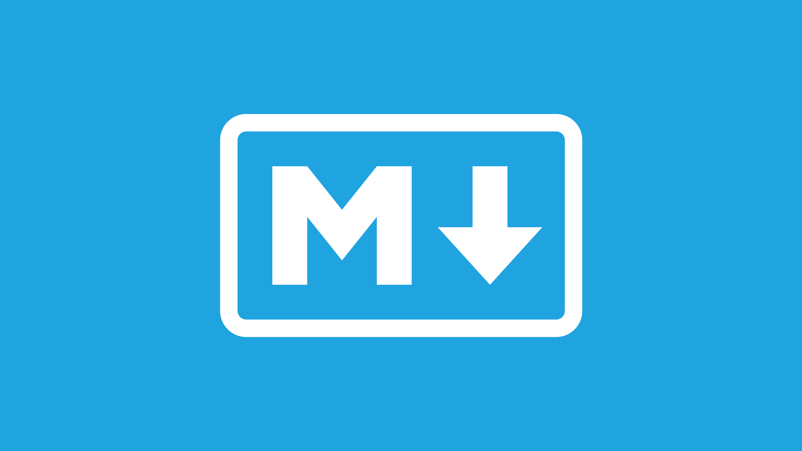

  

  
  
  

# Project Name

Lorem ipsum dolor sit amet, consectetur adipiscing elit, sed do eiusmod tempor incididunt ut labore et dolore magna aliqua. Ut enim ad minim veniam, quis nostrud exercitation ullamco laboris nisi ut aliquip ex ea commodo consequat.

## Summary

### Lorem Stuff

1. [Lorem](/languages.md)
2. [Ipsum](/languages.md)
3. [Dolor](/languages.md)

### Ipsum Stuff

1. [Lorem](/languages.md)
2. [Ipsum](/languages.md)
3. [Dolor](/languages.md)

## Contribute

Fork the repository and create a pull request.

## License

This project is licensed under the [Unlicense](https://unlicense.org/) - see the [LICENSE](LICENSE) file for details.